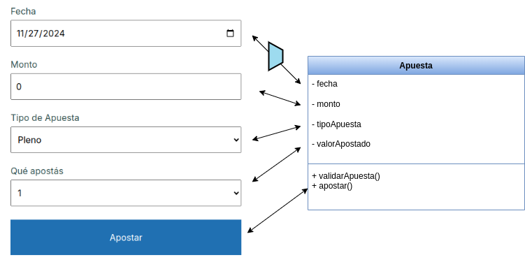

# Apuestas

[](https://github.com/uqbar-project/eg-apuestas-svelte/actions/workflows/build.yml) [](https://codecov.io/gh/uqbar-project/eg-apuestas-svelte)


## Binding del formulario

Cada input de la página tiene un binding con una propiedad de nuestro modelo que es la Apuesta. 



Una decisión que nos obliga a tomar Svelte es que el objeto de dominio Apuesta expone cada atributo como un $state:

```svelte
export class Apuesta {
	fecha: Date = $state(new Date())
	monto = $state(0)
	tipoApuesta: TipoApuesta = $state(PLENO)
	valorApostado: string | number = $state(1)
	resultado: Resultado | null = $state(null)
	errors: ValidationMessage[] = $state([])

  ...
```

Esto implica que **no podemos migrar directamente** este ejemplo a otras tecnologías como Angular o Vue sin hacer cambios. A favor ganamos que nuestro formulario puede utilizar el binding de los inputs sobre cada propiedad de Apuesta. Esto incluye **el binding anidado de tipo de apuesta y valor apostado, que están sincronizados**:

```svelte
	<div class="row">
		<label for="tipoApuesta">Tipo de Apuesta</label>
		<select ...	name="tipoApuesta" bind:value={apuesta.tipoApuesta}>
			{#each tiposApuesta as tipo}
				<option value={tipo}>{tipo.descripcion}</option>
			{/each}
		</select>
		<...>
	</div>
	<div class="row">
		<label for="apuesta">Qué apostás</label>
		<select ... name="apuesta" bind:value={apuesta.valorApostado}>
			{#each apuesta.tipoApuesta?.valoresAApostar ?? [] as valor}
				<option value={valor}>{valor}</option>
			{/each}
		</select>
		<...>
	</div>
```

En el caso de la fecha, dado que el input se asocia a un string, tenemos que utilizar una propiedad `fechaApuesta` que hace de intermediario, para luego adaptarla de String a Date.

```svelte
  <input type="date" data-testid="fechaApuesta" bind:value={fechaApuesta}
    onchange={() => {
      apuesta.fecha = dayjs(fechaApuesta).toDate()
    }}
```

### Tener un objeto Apuesta como $state de la página

Podríamos haber intentado tener un 
// https://github.com/sveltejs/svelte/issues/10560