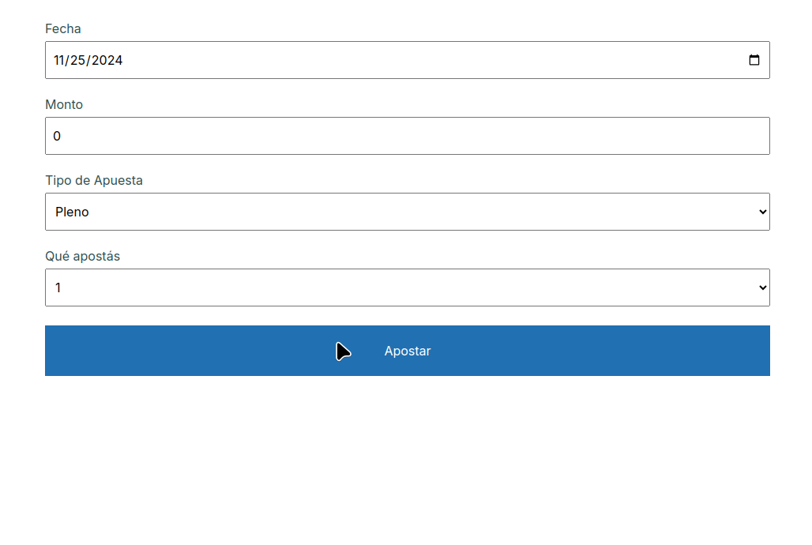

# Apuestas

 

## Binding del formulario

Cada input de la página tiene un binding con una propiedad de nuestro modelo que es la Apuesta. En el caso de la fecha, dado que el input se asocia a un string, tenemos que utilizar una propiedad que hace de intermediario, para luego adaptarla de String a Date.

